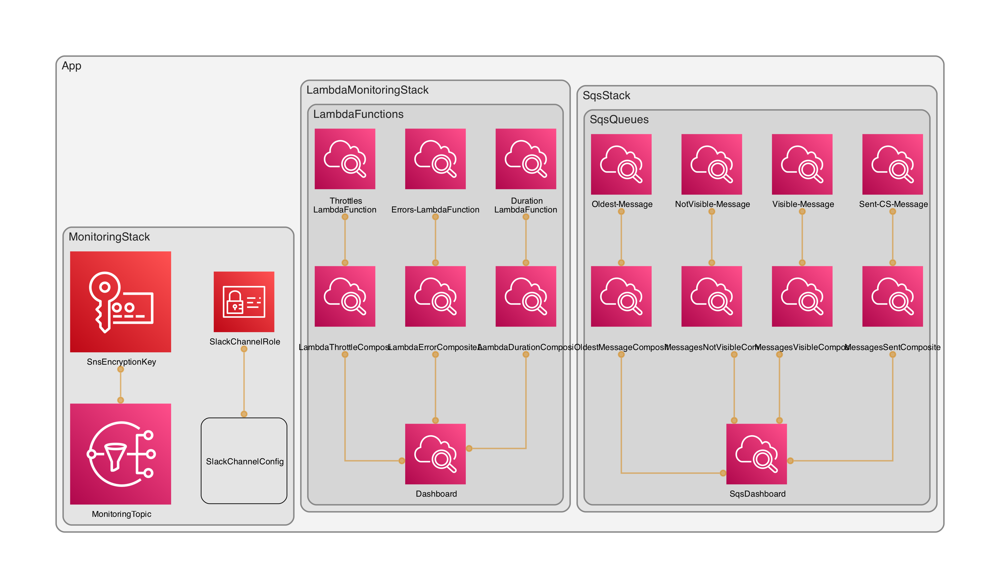

## Info AWS CDK Monitoring

### Deployment

Make sure you are in the correct AWS account: `0123456789`, deployment fails if you are in another account.           
**Important!** For the first deployment only deploy the SNS logic, because the Chatbot relies on the SNS resources, therefore they should be created first.

**Info:** this is a one-time operation, only under special conditions (for instance another Slack channel id) the `ChatbotStack` should be redeployed.

### Cloudwatch Dashboards with alarms to monitor the Distributie Lambda functions.
The building block of this monitoring stack are the generic constructs which can be reused by importing the class in your CDK app.
- Because we do not have the actual Lambda functions in the stacks, we import them by their ARN. Example:
```typescript
const lambdaFunction001 = Function.fromFunctionArn(this, 'ImportedLambdaFunction001', 'arn:aws:lambda:eu-west-1:0123456789:function:functionname');
const lambdaFunction002 = Function.fromFunctionArn(this, 'ImportedLambdaFunction002', 'arn:aws:lambda:eu-west-1:0123456789:function:functionname');
const lambdaFunction003 = Function.fromFunctionArn(this, 'ImportedLambdaFunction003', 'arn:aws:lambda:eu-west-1:0123456789:function:functionname');

```
- When creating a new dashboard, set the dashboard name in your monitoring stack here:
```typescript
new MonitoringConstruct(this, 'LambdaFunctions', {
    dashboardName: 'your-unique-dashboard-name-here'
})
```
- Make sure to change the ID and the description field in the stack to the correct service. Example:
```typescript
const monitoringtack = new MonitoringStack(app, 'YourAppNameHere', {
    description: 'Monitoring stack for the YourAppNameHere.',
    env,
});
```
- Descriptive names are used instead of the CDK generated ones, make sure you adjust them according to your service. Pass them into `throttleAlarmNames`, `errorAlarmNames`, `durationAlarmNames` and `customLabels`.
- New loggroups and/or Lambda functions can be removed or added. You pass them into `logGroups`.


## Create a composite alarm

If we want to create a composite alarm, combining multiple alarms in to one to reduce noise in your alert channel, we can do the following.
- Create an AlarmRule where we define the alarms that we want to group together.
- Create a CompositeAlarm and link the AlarmRule to it.
- Remove all AlarmActions from the alarm and add the AlarmAction to the CompositeAlarm.
- Optional: to remove noise we can add a SuppressorAlarm which holds off all other actions for a predefined DurationPeriod if it goes into AlarmState.

```typescript
const alarmRule = AlarmRule.anyOf(ErrorsAlarmA, ErrorsAlarmB, ErrorsAlarmC);
const compositeAlarm = new CompositeAlarm(this, 'CompositeAlarm', {
    compositeAlarmName: 'LogsErrorsAlarm',
    alarmRule: alarmRule,
    // actionsSuppressor: alarmA,
    // actionsSuppressorWaitPeriod: Duration.minutes(1),
    // actionsSuppressorExtensionPeriod: Duration.minutes(1),
    alarmDescription: 'Composite alarm which triggers an alarm when the error threshold is breached in a loggroup',
});
compositeAlarm.addAlarmAction(new SnsAction(yourSnsTopicHere));
```

In Cloudwatch logs insights you can save your queries, here is a pre-defined one. You can use a LogQueryWidget widget in your dashboard to see the results there.
```shell
fields @timestamp, unmask(@message)
| filter @message like /(?i)(error)/
| sort @timestamp desc
| display @message
| limit 20
```

### Development process via Makefile

To simplify the development process and provide an ability to run tests locally you can use the Makefile. You can execute a series of actions or execute individual steps.

* Build, test and validate: `make`
* Execute integration tests: `make testme`
* Validate new and changed stacks with the current state: `make compare`
* Cleanup the environment: `make clean`

Check the make file for more options.

### TypeScript documentation
Typedoc can be used to create the documentation. Just run `make ts-docs` in your terminal. The documentation is saved in the `docs` folder. If you prefer the documentation in Markdown format run `make md-docs`.

### Basic CDK logic

**[Read: best practices for CDK](https://docs.aws.amazon.com/prescriptive-guidance/latest/best-practices-cdk-typescript-iac/introduction.html)**

* The 'cdk.json' file tells the CDK Toolkit how to execute your app: 'npx ts-node --prefer-ts-exts'.                  
* The 'versionReporting' property allows you to turn off Metadata Reporting which the CDK team uses to collect analytics set this to "versionReporting": false.  
* The CDK CLI prompts you to approve security-related changes before deploying them. You can ignore that with: "requireApproval": "never".
* The 'context' key is used to keep track of feature flags.                           
* Feature flags enable the CDK team to push new features that introduce breaking changes, outside of major version releases.                  
* If you start a new project with the 'cdk init' command, all feature flags are set to true.          
* For existing projects you can decide for yourself to opt in if this feature flag might cause breaking changes.      


**For the latest CDK documentation, run `cdk docs` in your terminal.**

## Simple diagram example

